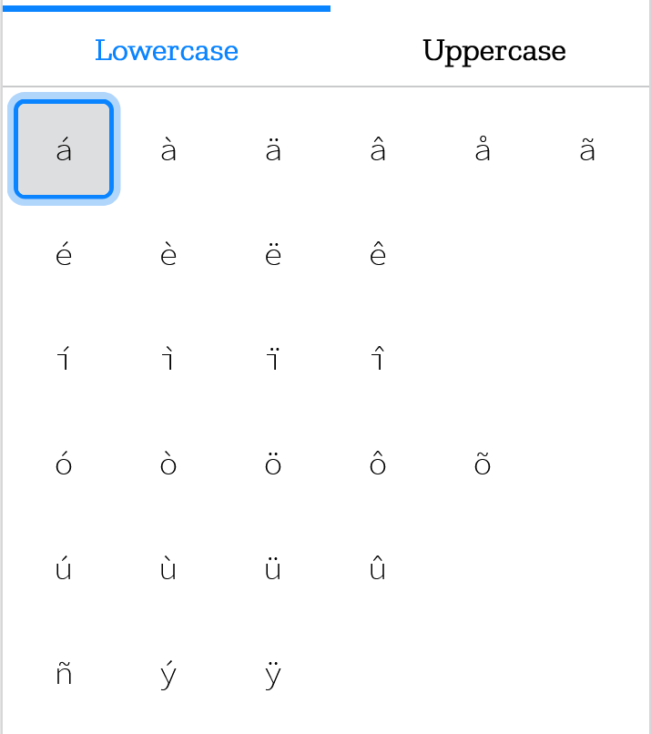
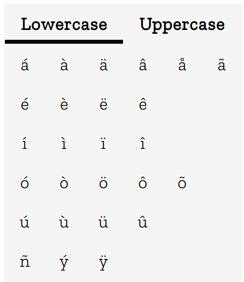

# Accented letters
This extension permits you to copy an accented letter in the clipboard. You can choose if you want to copy a lower letter or an upper letter.
It is published on Firefox Addons https://addons.mozilla.org/it/firefox/addon/accented-letters/.

## How to contribute
You can open an issue and there you must describe the feedback, the bug or the new feature you want.

## Screenshots

New UI (1.1+):

&nbsp;

Old UI (until 1.0):

