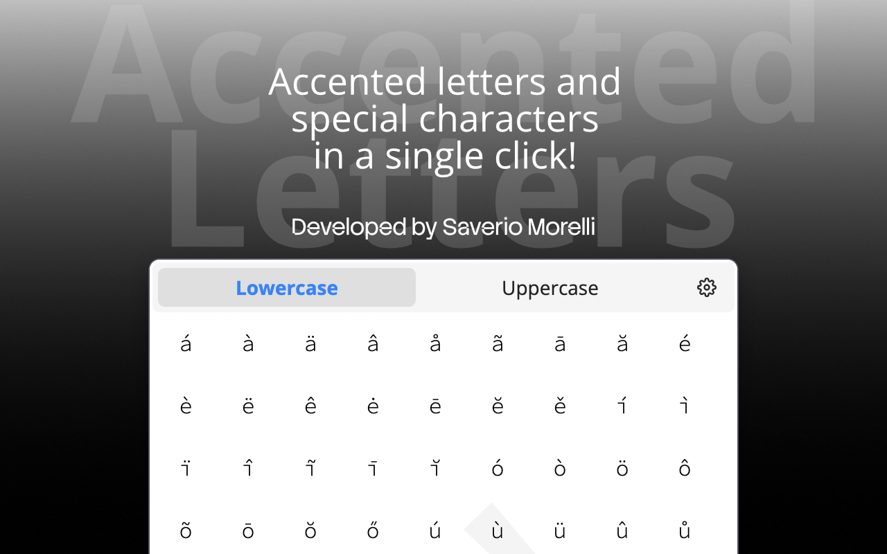

<h1 align="center">
     
    
     
    Accented Letters
     
</h1>

This extension allows you to copy or automatically insert accented letters and special characters with just one click. You can easily switch between lowercase and uppercase, enable auto-insert, and customize your character sets.

### Key Features
- **One-click Copy**: Quickly copy any character to your clipboard.
- **Auto-insert**: Automatically insert the selected character directly into the active text field.
- **Search**: Find characters instantly across all sets with the built-in search bar.
- **Uppercase / Lowercase**: Easily switch between lowercase and uppercase variants of all characters.
- **Language Sets**: Enable additional character sets for various languages (French, German, Spanish, Portuguese, Polish, Czech, Nordic, Romanian, Greek, Cyrillic, etc.) and symbols (arrows, currency, math).
- **Personalized Characters**: Add your own custom characters through the settings.
- **Hide Characters**: Show or hide individual characters to keep the popup clean and focused.
- **Font Customization**: Choose your preferred font family for character display.
- **Backup & Restore**: Export and import your settings as a JSON file.
- **Multilingual UI**: Interface available in 14 languages (English, Italian, French, German, Spanish, Portuguese, Russian, Ukrainian, Polish, Japanese, Arabic, Swedish, Dutch, and Interlingua).
- **Grouped View**: Organized layout with titles for each character set.

Official repository of https://addons.mozilla.org/it/firefox/addon/accented-letters/.

   

To support me, you can do a donation :smile: with **PayPal**, **LiberaPay** or **Ko-Fi**:

 [</img>](https://paypal.me/saveriomorelli) [</img>](https://ko-fi.com/R5R31UQ8G)

## How to contribute
You can open an issue and there you must describe the feedback, the bug or the new feature you want. You can request a new language too.

## Screenshots

## License

