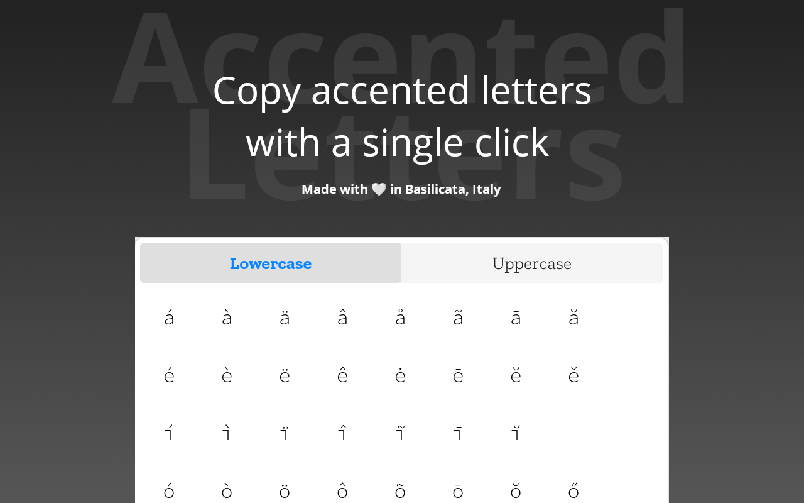

<h1 align="center">
     
    
     
    <h1>Accented Letters</h1>
     
</h1>

This extension permits you to copy an accented letter in the clipboard. You can choose if you want to copy a lower letter or an upper letter. It supports 66 accented letters.
Official repository of https://addons.mozilla.org/it/firefox/addon/accented-letters/.

   

To support me, you can do a donation :smile: with **PayPal**, **LiberaPay** or **Ko-Fi**:

 [</img>](https://paypal.me/pools/c/8yl6auiU6e) [</img>](https://ko-fi.com/R5R31UQ8G)

## How to contribute
You can open an issue and there you must describe the feedback, the bug or the new feature you want. You can request a new language too.

## Supported languages

The add-on is translated in these following languages (sort A-Z):

- Arabic (`ar`)
- English (default - `en-US`, `en-UK`, `en-CA`)
- German (`de`)
- Spanish (`es-ES`, `es-AR`, `es-CL`, `es-MX`)
- French (`fr`)
- Italian (`it`)
- Japanese (`ja`)
- Dutch (`nl`)
- Polish (`pl`)
- Portuguese (`pt-PT`, `pt-BR`)
- Chinese (`zh-CN`, `zh-TW`)

## Screenshots

## License

